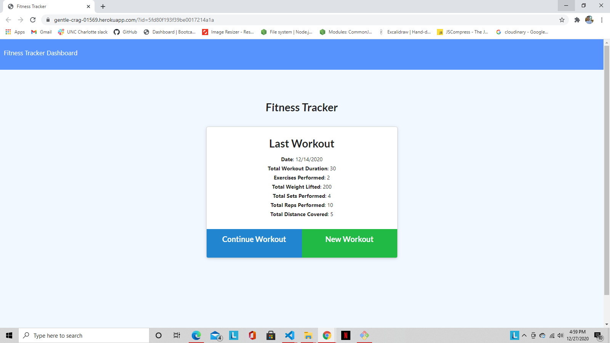

# Fitness-Tracker# Title
  Fitness Tracker
  

  ## Developer:
  Jesse Ziros

  ## Description
  This app will allow you to create new workouts and track previously completed workouts. It will display the workouts that have been completed in the dashboard section of the app in a very neat and easy to read format. In the fitness tracker portion of the app is where you will find your last workout completed with all information from it, and links to continue the workout or create a new one. When creating a new workout you will be able to input multiple excercises with the option for them to be cardio or resistance. Both excercises have their own options for input and will be saved accordingly.

  ## Table
  * [Installation](##Installation)
  * [Usage](##Usage)
  * [Questions](##Questions)
  * [Contributing](##Contributing)
  * [License](##License)
  * [Test](##Test)

  ## Installation
  It uses the npm mongodb package utilizing mongoose as well. It operates through routes used to navigate the front end as well as manage data going back and forth from front end to back end. Uses a server.js to spin up the page itself, also contains seeded data and a public folder containing all the front end files. 

  ## Usage
  You will be able to input new excercises to your current workout. Once your workout is completed you will click on complete and it will log all activities done in the work out in the fitness tracker section. All completed workouts are saved into the database and displayed on the Dashboard section of the app so you can track your progress from when you started working out to current.

  

  ## Questions
  If you have any questions contact me at:

  jtziros2020@gmail.com
  
  *[Github Username]
  jesseziros

  ## Contributing
  N/A

  ## License
  MIT

  ## Test
  N/A
